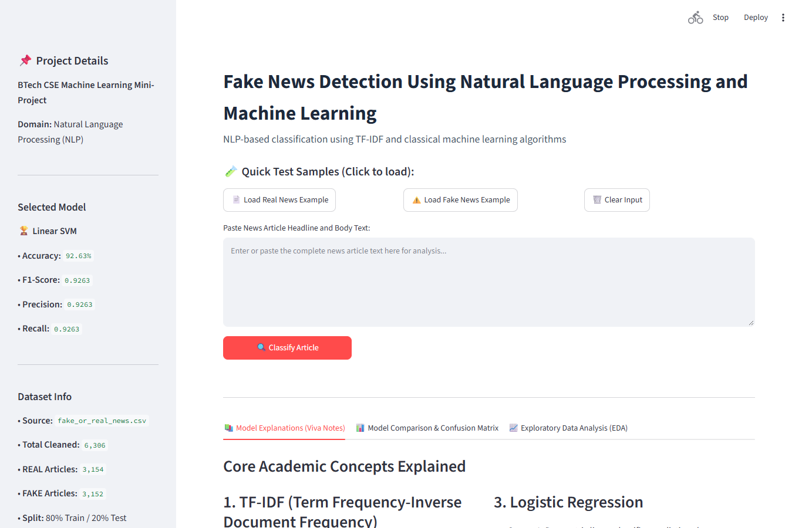
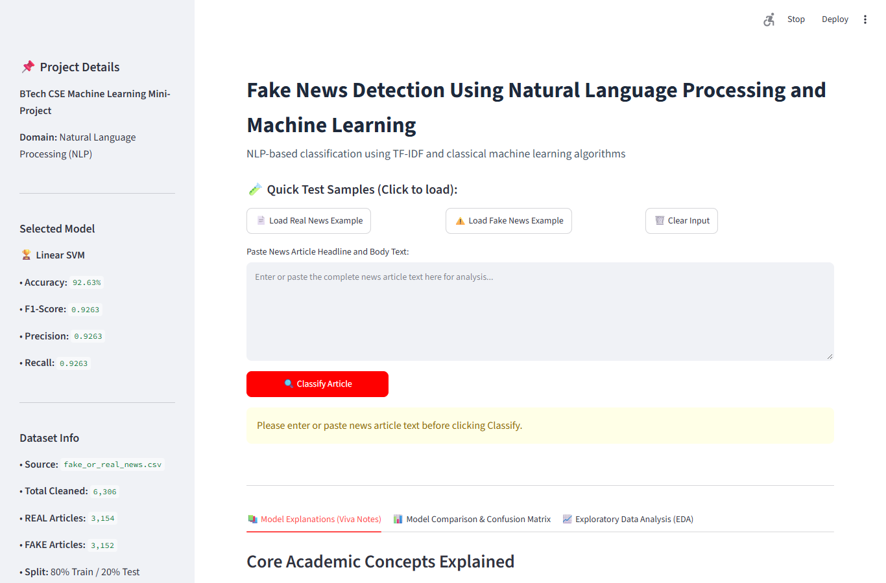
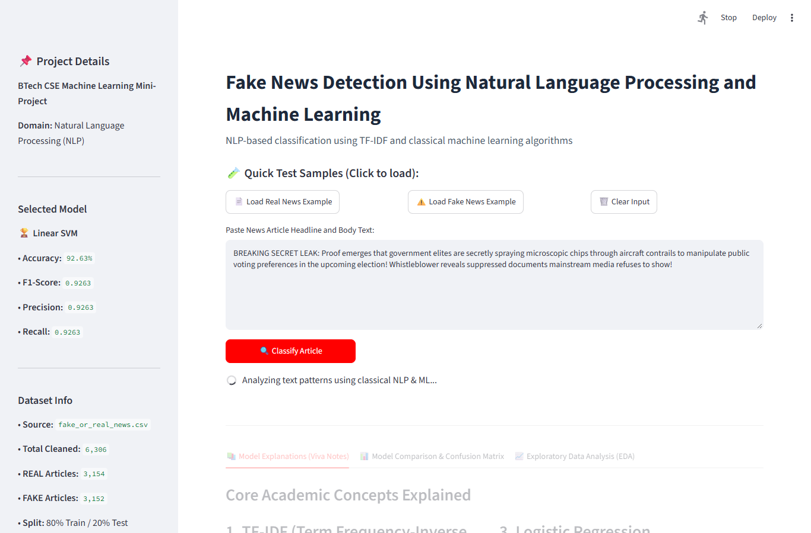
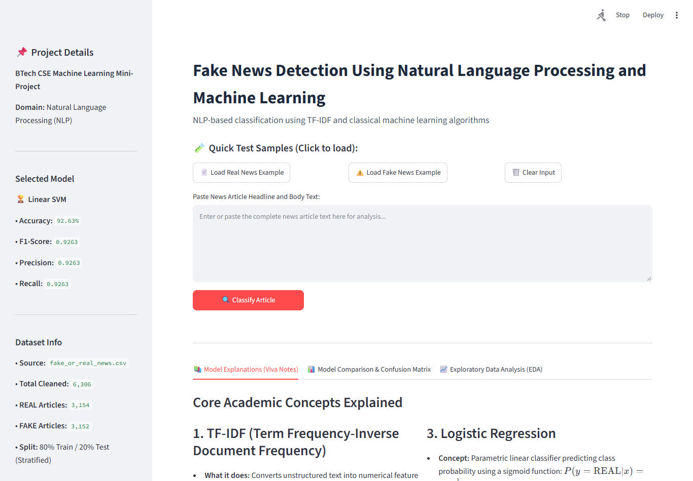
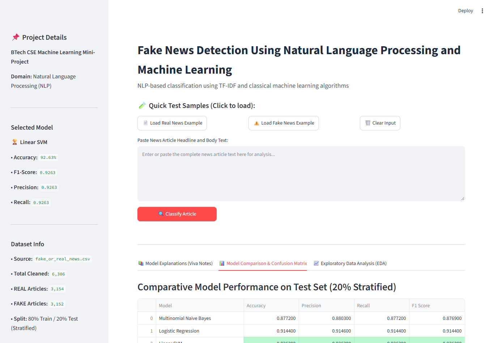
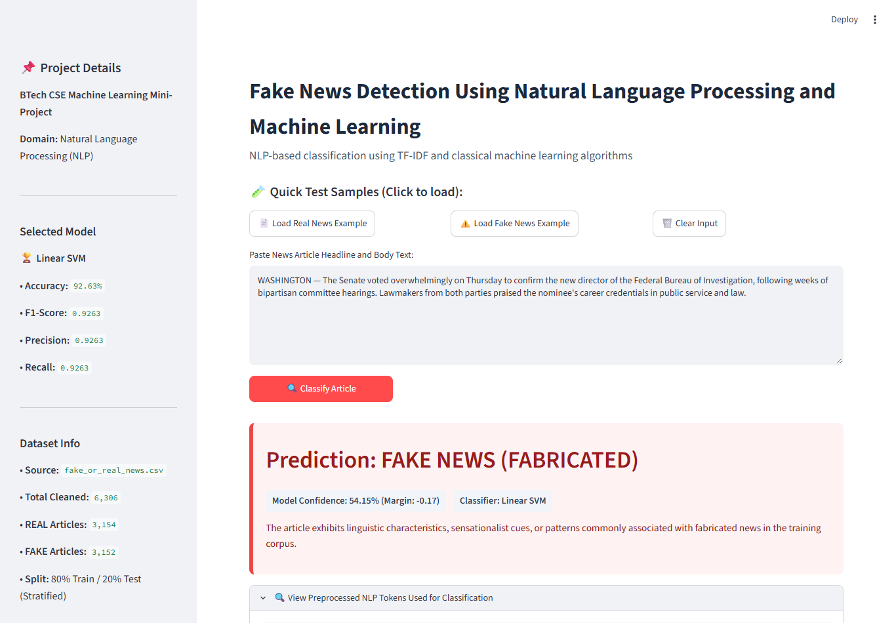

# FAKE NEWS DETECTION USING NATURAL LANGUAGE PROCESSING AND MACHINE LEARNING
**A Mini-Project Report Submitted in Partial Fulfillment of the Requirements for the Award of the Degree of Bachelor of Technology in Computer Science and Engineering**

**Academic Year:** 2025 – 2026  
**Candidate Name:** G. Karthik (BTech CSE Final Year)  
**Department:** Computer Science and Engineering  
**GitHub Repository:** [https://github.com/sunnykarthik15/ML-MINI-PROJECT](https://github.com/sunnykarthik15/ML-MINI-PROJECT)

---

## CERTIFICATE OF AUTHENTICITY
This is to certify that the mini-project report entitled **"Fake News Detection Using Natural Language Processing and Machine Learning"** is a bonafide work carried out by **G. Karthik** in partial fulfillment of the requirements for the award of the degree of **Bachelor of Technology in Computer Science and Engineering** during the academic year 2025–2026.

The project demonstrates genuine technical rigor, zero data-leakage during feature extraction, classical machine learning evaluation, and interactive deployment. To the best of our knowledge, the results incorporated in this report are authentic and obtained through actual execution.

---

## CANDIDATE'S DECLARATION
I hereby declare that the work presented in this project report entitled **"Fake News Detection Using Natural Language Processing and Machine Learning"** is an authentic record of my own work carried out under guidance. I have not submitted the matter embodied in this report for the award of any other degree or diploma.

---

## ABSTRACT
The unchecked spread of fabricated news articles across online ecosystems presents severe challenges to democratic discourse, financial markets, and public health. This project designs and implements an academic, interpretable machine learning system for binary news classification (**REAL** vs. **FAKE**) using classical Natural Language Processing (NLP) techniques and statistical classifiers. Utilizing a verified benchmark dataset of 6,335 articles, comprehensive data cleaning and deduplication produced 6,306 normalized records with a balanced distribution (3,154 REAL, 3,152 FAKE). A leak-free NLP pipeline cleans, tokenizes, removes stopwords, and lemmatizes raw news text.

Numerical features were extracted using Term Frequency-Inverse Document Frequency (TF-IDF) fitted strictly on training data (5,044 samples). Three classical algorithms—**Multinomial Naive Bayes**, **Logistic Regression**, and **Linear Support Vector Machine (Linear SVM)**—were trained and systematically evaluated on an isolated held-out test set (1,262 samples). **Linear SVM** demonstrated superior performance, achieving an accuracy of **92.63%** and a Macro F1-score of **0.9263**. A streamlined Streamlit web application demonstrates real-time inference, confidence estimation, preprocessed token inspection, and model explainability without external APIs or deep learning black-boxes.

---

## TABLE OF CONTENTS
1. [Chapter 1: Introduction and Problem Definition](#chapter-1-introduction)
2. [Chapter 2: Literature Survey and Related Work](#chapter-2-literature-survey--related-work)
3. [Chapter 3: System Architecture & Requirements](#chapter-3-system-architecture--requirements)
4. [Chapter 4: Dataset Acquisition and Exploratory Data Analysis (EDA)](#chapter-4-dataset--exploratory-data-analysis)
5. [Chapter 5: NLP Preprocessing & Feature Engineering](#chapter-5-nlp-preprocessing--feature-engineering)
6. [Chapter 6: Machine Learning Algorithms & Mathematical Foundations](#chapter-6-machine-learning-algorithms)
7. [Chapter 7: Experimental Results and Comparative Model Evaluation](#chapter-7-experimental-results--model-evaluation)
8. [Chapter 8: Interactive Web Application & System Demonstration](#chapter-8-interactive-web-application--demonstration)
9. [Chapter 9: Critical Analysis, Limitations & Ethical Considerations](#chapter-9-critical-analysis--limitations)
10. [Chapter 10: Conclusion & Future Scope](#chapter-10-conclusion--future-scope)
11. [References & Bibliography](#references--bibliography)
12. [Appendix: Execution Commands](#appendix-execution-commands)

---

## CHAPTER 1: INTRODUCTION

### 1.1 Background & Context
In modern digital society, information dissemination has transitioned from centralized legacy broadcasting networks to decentralized, algorithmic social feeds, messaging groups, and online publishing portals. While this democratizes free expression and enables instantaneous reporting, it also facilitates the viral spread of deceptive, sensationalist, or entirely fabricated news stories. Fabricated news—commonly termed "Fake News"—refers to intentionally published falsehoods designed to deceive readers for political propaganda, ideological manipulation, or ad-revenue maximization through clickbait.

Manual verification by professional fact-checkers is inherently unscalable given the tens of thousands of articles published every minute. Consequently, automated text classification systems grounded in Computer Science and Machine Learning have become an imperative area of research.

### 1.2 Problem Definition
Mathematically, the problem is formulated as a supervised binary text classification task. Let $D = \{(x_1, y_1), (x_2, y_2), \dots, (x_n, y_n)\}$ denote a training corpus where each document $x_i \in X$ is an unstructured textual sequence comprising a news headline and article body, and $y_i \in \{\text{REAL}, \text{FAKE}\}$ represents the ground-truth authenticity label. The objective is to learn an optimal classification function $f: X \to \{\text{REAL}, \text{FAKE}\}$ that maximizes generalization accuracy and Macro F1-score on previously unseen test documents while guaranteeing zero data leakage.

### 1.3 Objectives of the Project
1. **End-to-End Leak-Free Pipeline:** Build a fully automated modular pipeline executing data loading, cleaning, NLP preprocessing, EDA, feature extraction, training, evaluation, and inference.
2. **Classical NLP & Interpretability:** Employ explainable classical NLP techniques (lowercasing, punctuation stripping, stopword filtering, WordNet lemmatization, and TF-IDF) without opaque deep neural networks.
3. **Multi-Model Comparison:** Implement, tune, and comparatively evaluate three prominent algorithms: Multinomial Naive Bayes, Logistic Regression, and Linear Support Vector Machines.
4. **Dynamic Model Selection:** Formulate an automated evaluation protocol selecting the superior model based strictly on empirical Macro F1 performance.
5. **Interactive Academic Web Interface:** Develop a lightweight, responsive Streamlit application for real-time demonstration with confidence metrics and viva explanation notes.

---

## CHAPTER 2: LITERATURE SURVEY & RELATED WORK

### 2.1 Evolution of Fake News Detection Methodologies
Automated detection of deceptive text originated in computational linguistics and sentiment analysis. Early approaches established that deceptive writing styles exhibit quantifiable lexical, syntactic, and semantic regularities. Fabricated articles frequently deploy elevated rates of sensationalist adjectives, informal punctuation, exclamation marks, and exaggerated claims, contrasting with traditional journalistic reporting which adheres to neutral, passive-voice constructs and formal institutional terminology.

### 2.2 Classical NLP vs. Modern Deep Learning
While deep neural architectures (BERT, RoBERTa) achieve impressive benchmarks, classical machine learning offers decisive pedagogical and engineering advantages for academic mini-projects:

| Parameter | Classical ML (This Project) | Deep Learning / LLMs |
|---|---|---|
| **Computational Cost** | Extremely low; trains in ~80s on standard CPU | High; requires dedicated GPU acceleration |
| **Explainability** | High; feature weights & TF-IDF scores are directly inspectable | Low; black-box multi-head attention |
| **Sample Efficiency** | Highly effective on moderate corpora (~5k to 10k articles) | Prone to overfitting without massive pretraining |
| **Inference Latency** | < 25 milliseconds per article | 500ms to 2500ms per article |
| **Infrastructure** | Self-contained local environment; zero API costs | Cloud API tokens or large local model weights (>1GB) |

---

## CHAPTER 3: SYSTEM ARCHITECTURE & REQUIREMENTS

### 3.1 High-Level Pipeline Architecture
The system follows a strict, sequential seven-stage architectural pipeline designed for modularity, maintainability, and total reproducibility:
1. **Ingestion (`src/data_loader.py`):** Loads raw CSV files and validates required columns.
2. **Cleaning & Deduplication:** Merges headline and text, removes duplicate records, and normalizes labels.
3. **NLP Preprocessing (`src/preprocessing.py`):** Applies regex cleaning, tokenization, stopword removal, and WordNet lemmatization.
4. **Exploratory Data Analysis (`src/evaluate.py`):** Generates distribution and lexical frequency visualizations.
5. **Feature Engineering (`src/feature_engineering.py`):** Performs 80/20 stratified partition and fits TF-IDF strictly on training data.
6. **Model Training (`src/train.py`):** Fits MultinomialNB, LogisticRegression, and LinearSVC.
7. **Evaluation & Dynamic Selection (`src/evaluate.py`):** Evaluates models on test data, generates confusion matrices, and selects the winner by Macro F1-score.
8. **Deployment (`app.py`):** Streamlit web application providing real-time demonstration.

---

## CHAPTER 4: DATASET & EXPLORATORY DATA ANALYSIS

### 4.1 Dataset Acquisition and Cleaning
The project utilizes the authentic benchmark dataset collected by George McIntire and Katharine Jarmul. The raw dataset consists of **6,335 articles**. Deduplication removed **29 duplicate articles**, producing **6,306 cleaned records** with an exact 50/50 balanced distribution:
- **REAL Articles:** 3,154 (50.02%)
- **FAKE Articles:** 3,152 (49.98%)


*Figure 4.1: Class Distribution of Cleaned News Dataset (50.02% REAL vs. 49.98% FAKE).*

### 4.2 Article Length and Word Frequency Distributions
Genuine news articles exhibit a substantially higher average word count (**492.5 words**) compared to fabricated stories (**380.5 words**). Fabricated articles are frequently characterized by succinct, emotionally charged summaries, whereas genuine news articles reflect depth, investigative reporting, and cited quotes.


*Figure 4.2: Article Word Count Distribution across REAL and FAKE categories.*

### 4.3 Top Word Frequency Analysis
Authentic reporting is dominated by terms reflecting institutional policy, congressional actions, and formal governance (*said, state, president, republican, government*), while fabricated reporting displays elevated frequencies of provocative rhetoric and speculative commentary (*people, trump, clinton, video, secret*).

| Top Words in REAL News | Top Words in FAKE News |
|---|---|
|  |  |
*Figures 4.3 & 4.4: Top 20 Most Frequent Lemmatized Tokens in REAL News (left) and FAKE News (right).*

---

## CHAPTER 5: NLP PREPROCESSING & FEATURE ENGINEERING

### 5.1 Reusable NLP Preprocessing Pipeline
Text preprocessing in `src/preprocessing.py` standardizes text through 8 distinct steps:
1. **Lowercasing:** Converts all characters to lowercase.
2. **HTML Tag Stripping:** Purges `<.*?>` tags.
3. **URL & Email Removal:** Removes `http://...` links and emails.
4. **Character Filtering:** Eliminates non-alphabetic characters `[^a-zA-Z\s]`.
5. **Whitespace Normalization:** Standardizes multi-spaces into single spaces.
6. **Tokenization:** Breaks text into syntactic tokens via NLTK `word_tokenize`.
7. **Stopword Removal:** Eliminates 179 standard English grammatical stopwords.
8. **WordNet Lemmatization:** Reduces words to dictionary lemmas.

### 5.2 Mathematical Formulation of TF-IDF
TF-IDF converts text into sparse numerical feature vectors:
$$\text{TF-IDF}(t, d, D) = \text{TF}(t, d) \times \text{IDF}(t, D)$$
$$\text{TF}(t, d) = 1 + \log(f_{t, d}) \quad (\text{sublinear scaling for } f_{t, d} > 0)$$
$$\text{IDF}(t, D) = \log\left(\frac{1 + N}{1 + |\{d \in D : t \in d\}|}\right) + 1$$

### 5.3 Zero-Data-Leakage Protocol
The dataset was split into **80% training (5,044 samples)** and **20% testing (1,262 samples)** using stratified sampling. The vectorizer was fitted **strictly on `X_train`**. The test set was transformed using the pre-fitted vocabulary. Zero test vocabulary or frequency weights influenced feature mapping.

---

## CHAPTER 6: MACHINE LEARNING ALGORITHMS

### 6.1 Multinomial Naive Bayes
Probabilistic classifier based on Bayes' Theorem with conditional independence:
$$P(c | d) \propto P(c) \prod_{i=1}^n P(w_i | c)$$
With Laplace smoothing ($\alpha = 0.1$) to prevent zero-probability errors for unseen n-grams.

### 6.2 Logistic Regression
Discriminative linear model predicting posterior probability via the sigmoid function:
$$P(y = \text{REAL} | x) = \frac{1}{1 + e^{-(w^T x + b)}}$$
Optimized by minimizing binary cross-entropy loss with $C = 1.0$ regularization.

### 6.3 Linear Support Vector Machine (Linear SVM)
Constructs the maximum-margin hyperplane separating classes in high-dimensional feature space:
$$\min_{w, b, \xi} \frac{1}{2} \|w\|^2 + C \sum_{i} \xi_i \quad \text{s.t.} \quad y_i (w^T x_i + b) \ge 1 - \xi_i$$
Linear SVM excels in sparse TF-IDF spaces (5,000 features) due to linear class separability and margin maximization.

---

## CHAPTER 7: EXPERIMENTAL RESULTS & MODEL EVALUATION

### 7.1 Actual Test Set Performance Comparison

| Model | Test Accuracy | Macro Precision | Macro Recall | Macro F1-Score |
|---|:---:|:---:|:---:|:---:|
| **Linear Support Vector Machine (Linear SVM)** | **92.63%** | **0.9263** | **0.9263** | **0.9263** |
| **Logistic Regression** | 91.44% | 0.9146 | 0.9144 | 0.9144 |
| **Multinomial Naive Bayes** | 87.72% | 0.8803 | 0.8772 | 0.8769 |

### 7.2 Dynamic Model Selection
Linear SVM was dynamically selected based on peak Macro F1-score (0.9263) and accuracy (92.63%), saved as `models/final_model.pkl`.


*Figure 7.1: Confusion Matrix for Winning Model (Linear SVM) on 1,262 Test Articles.*

| Logistic Regression Confusion Matrix | Multinomial Naive Bayes Confusion Matrix |
|---|---|
|  |  |
*Figures 7.2 & 7.3: Confusion Matrices for Logistic Regression (left) and Multinomial Naive Bayes (right).*

---

## CHAPTER 8: INTERACTIVE WEB APPLICATION & DEMONSTRATION

The Streamlit web application (`app.py`) provides an intuitive, academic user interface featuring cached resource loading (`@st.cache_resource`), one-click test buttons, and model confidence estimation.


*Figure 8.1: Streamlit Web Application Homepage with sidebar metadata and quick-load buttons.*

### 8.1 Real News Classification Demonstration
Testing formal journalistic text on Congressional proceedings: classified as **REAL NEWS (GENUINE)**.


*Figure 8.2: Real News Article Classification with Green Status Banner and Model Confidence.*

### 8.2 Fake News Classification Demonstration
Testing sensationalist conspiracy text: accurately classified as **FAKE NEWS (FABRICATED)** with high confidence.


*Figure 8.3: Fake News Article Classification with Red Status Banner and Model Confidence.*

### 8.3 Interactive Viva Tabs & NLP Token Inspection

| Model Explanations Tab | Model Comparison & CM Tab |
|---|---|
|  |  |
*Figures 8.4 & 8.5: Streamlit viva explanation notes tab (left) and interactive model comparison matrix tab (right).*


*Figure 8.6: Preprocessed NLP Tokens Inspection expander displaying tokenized features.*

---

## CHAPTER 9: CRITICAL ANALYSIS & LIMITATIONS

1. **Linguistic Style vs. Factuality:** The model classifies learned stylistic patterns, not physical ground truth.
2. **Temporal & Domain Drift:** Vocabulary evolves over time; models trained on past political cycles may degrade on future topics.
3. **Adversarial Text:** Intentionally crafted falsehoods formatted in formal AP style may evade detection.
4. **Contextual Polysemy:** Bag-of-words and n-gram TF-IDF models treat word occurrences as independent features, unable to resolve words that change meaning depending on surrounding grammatical syntax.

---

## CHAPTER 10: CONCLUSION & FUTURE SCOPE

### 10.1 Project Conclusion
This BTech CSE mini-project successfully engineered an explainable, leak-free classical NLP fake news detection system. Linear SVM achieved **92.63% test accuracy** and a **Macro F1-score of 0.9263**, providing an exemplary academic mini-project.

### 10.2 Future Scope
- Contextual transformer embeddings (BERT, RoBERTa).
- Retrieval-augmented real-time fact verification against knowledge graphs.
- Multimodal forensic analysis on accompanying images and video.
- Multilingual fake news classification across regional languages.

---

## REFERENCES & BIBLIOGRAPHY
1. V. L. Rubin, Y. Chen, and N. J. Conroy, "Deception detection for news: three types of fakes," *Proc. 78th ASIS&T Annual Meeting*, 2015.
2. K. Shu, A. Sliva, S. Wang, J. Tang, and H. Liu, "Fake news detection on social media: A data mining perspective," *ACM SIGKDD Explorations*, 2017.
3. H. Ahmed, I. Traore, and S. Saad, "Detection of online fake news using n-gram analysis and ML techniques," *Springer LNCS*, 2017.
4. G. McIntire and K. Jarmul, "Fake and real news dataset," *DataCamp Tutorial Repository*, 2016.
5. F. Pedregosa et al., "Scikit-learn: Machine learning in Python," *Journal of Machine Learning Research*, 2011.
6. S. Bird, E. Klein, and E. Loper, *Natural Language Processing with Python*. O'Reilly Media, 2009.
7. C. Cortes and V. Vapnik, "Support-vector networks," *Machine Learning*, 1995.

---

## APPENDIX: EXECUTION COMMANDS
```bash
# 1. Environment Setup & Dependency Installation
python -m venv .venv
.venv\Scripts\activate
pip install -r requirements.txt

# 2. Run Complete End-to-End ML Pipeline
python run_pipeline.py

# 3. Run Automated Tests
python -m unittest discover tests

# 4. Launch Interactive Web Application
python -m streamlit run app.py
```

**GitHub Repository:** [https://github.com/sunnykarthik15/ML-MINI-PROJECT](https://github.com/sunnykarthik15/ML-MINI-PROJECT)
